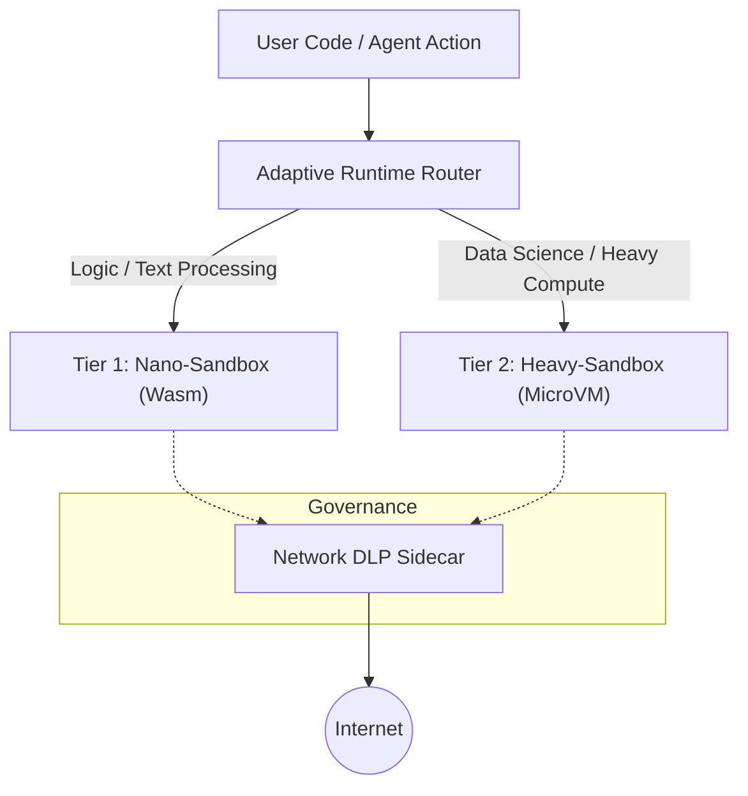

# ⏳ EnterSandBox

**Governance-First AI Agent Runtime Platform**

[](LICENSE)
[](docs/PLAN.md)

EnterSandBoxは、自律型AIエージェントの「ガバナンス」と「可観測性」に焦点を当てた、次世代のコード実行プラットフォームです。
単なる高速なコード実行環境（Runner）にとどまらず、ハイブリッドランタイム技術を用いることで「速度」と「互換性」の両立を実現し、同時に企業のセキュリティ要件を満たす強力な統制機能を提供します。

---

## 🚀 Why EnterSandBox?

自律型AIエージェントの台頭により、インフラストラクチャには新たな要件が求められています。

*   **信頼できないコードの実行:** エージェントが生成するコードは未知であり、潜在的に危険です。
*   **レイテンシへの感受性:** チャットUXを損なわないミリ秒単位の起動速度が必要です。
*   **データサイエンスの壁:** 軽量なWASMだけでは、PandasやNumPyといった必須ライブラリが動きません。
*   **ガバナンスの欠如:** 従来のアプローチでは、エージェントによる情報漏洩（DLP）や意図しないアクセスを防げません。

EnterSandBoxは、これらの課題を解決する**「AIエージェントのためのOS」**です。

## ✨ Key Features

### 1. Hybrid Runtime Architecture
タスクの性質に応じて、最適なランタイムを動的に選択・ルーティングします。

| Tier | 名称 | 技術 | 起動速度 | 用途 |
| --- | --- | --- | --- | --- |
| **Tier 1** | **Nano-Sandbox** | Wasmtime + RustPython | **< 10ms** | 制御ロジック、文字列操作、JSONパース |
| **Tier 2** | **Heavy-Sandbox** | Firecracker MicroVM | **~150ms** | データ分析(Pandas), 機械学習, 複雑な依存関係 |

### 2. Agency Governance (Network DLP)
エージェントの暴走を防ぎ、企業コンプライアンスを遵守します。

*   **PII Scanning:** 通信内容をリアルタイム検査し、APIキーや個人情報の流出を遮断。
*   **Intent-based Whitelist:** エージェントの「現在の意図」に基づいて、アクセス可能なドメインを動的に制限。
*   **監査ログ:** 全てのアクションと通信を記録し、完全なトレーサビリティを提供。

### 3. Time Travel Debugging
開発者体験（DX）を革新するデバッグ機能を提供します。

*   **Stepwise Snapshots:** 実行の各ステップでメモリとディスクの状態を保存。
*   **Rewind & Inspect:** エラー発生直前の状態に「巻き戻し」、変数の値やファイルの中身を調査可能。

## 🛠 Architecture



## 🧩 Usage (Preview)

ユーザーは背後のランタイムを意識することなく、統一されたAPIを利用できます。

```python
from agentbox import Sandbox, SandboxConfig

config = SandboxConfig(memory_limit_mb=256, timeout_ms=3000, max_output_bytes=8 * 1024 * 1024)
box = Sandbox(config)

result = box.run("print('Hello from sandbox')")
print(result.stdout)
```

## 🧾 SDK API（現行実装）

- `Sandbox(config: Optional[SandboxConfig] = None)`
- `Sandbox.run(code: str) -> SandboxResult`
- `Sandbox.config -> SandboxConfig`
- `SandboxConfig(memory_limit_mb: Optional[int], timeout_ms: Optional[int], max_output_bytes: Optional[int])`
- `SandboxResult(stdout: str, stderr: str, exit_code: int)`

## 🧪 CPython WASI 再現手順（P1-070〜P1-077）

このリポジトリには、WASI 初期化リグレッションを調査・回帰防止するための
CPython WASI 再現ハーネス（デバッグ用途）が含まれます。

### 対象範囲と制約

- 再現機能は `agentbox._core` のデバッグ API としてのみ公開:
  - `_debug_run_cpython_wasi_repro(profile, code=None, timeout_ms=None, max_output_bytes=None)`
  - `_debug_describe_cpython_wasi_context_diff()`
- `Sandbox.run()` はまだこの CPython WASI 経路を使いません（`P1-078` 未完了）。
- `sdk-legacy` は旧 preopen マッピング（`/sandbox`）を意図的に保持し、
  既知失敗（`No module named 'encodings'`）の回帰検証に使います。

### 1) 固定化されたランタイムアセットを準備

```bash
python3 scripts/prepare_cpython_wasi_assets.py
python3 scripts/prepare_cpython_wasi_assets.py --check-only
```

- マニフェスト: `assets/cpython-wasi/manifest.json`
- 現行固定アーティファクト: CPython WASI `3.13.12` (`python-3.13.12-wasi_sdk-24.zip`)
- 詳細: `assets/cpython-wasi/README.md`

### 2) CLI/SDK コンテキスト差分を確認

```python
from agentbox import _core

print(_core._debug_describe_cpython_wasi_context_diff())
```

テストで固定している期待値:
- `preopen.guest_path` は `cli` と `sdk` で `/` に一致
- clock/RNG のソースは `same-source`
- `random.insecure_seed` は `runtime-generated`（毎回再生成）

### 3) 成功系/失敗系を再現

```python
from agentbox import _core

success, stdout, stderr, error = _core._debug_run_cpython_wasi_repro(
    "sdk",
    "import json\nprint('ok')\n",
    timeout_ms=50,
    max_output_bytes=4096,
)
```

- プロファイル: `cli`, `sdk`, `sdk-legacy`
- 失敗トレースには `trace.capture=wasm-backtrace-v1` を付与
- timeout / 出力上限は Rust・Python の双方で回帰テスト済み

### 4) 回帰テストの実行

```bash
cd agentbox-core && cargo test cpython_wasi_repro -- --nocapture
pytest -q tests/python/test_cpython_wasi_repro.py
```

## 🗺 Roadmap

詳細は [docs/PLAN.md](docs/PLAN.md) を参照してください。

- **Phase 1:** Nano-Sandbox (MVP) - Wasmベースの超高速実行環境
- **Phase 2:** Heavy-Sandbox & Routing - Firecracker統合とデータサイエンス対応
- **Phase 3:** Governance & Security - ネットワークDLPとMCPネイティブ対応
- **Phase 4:** Time Travel - デバッグ機能とUIの実装

## 📚 Documentation

- [機能仕様書 (SPEC.md)](docs/SPEC.md)
- [実装計画 (PLAN.md)](docs/PLAN.md)
- [リサーチレポート (RESEARCH.md)](docs/RESEARCH.md)
- [CPython WASI 再現アセット](assets/cpython-wasi/README.md)

## 🤝 Contributing

EnterSandBoxはオープンソースプロジェクトとして開発される予定です。
貢献ガイドラインは準備中です。

## 📄 License

MIT License (Planned)
