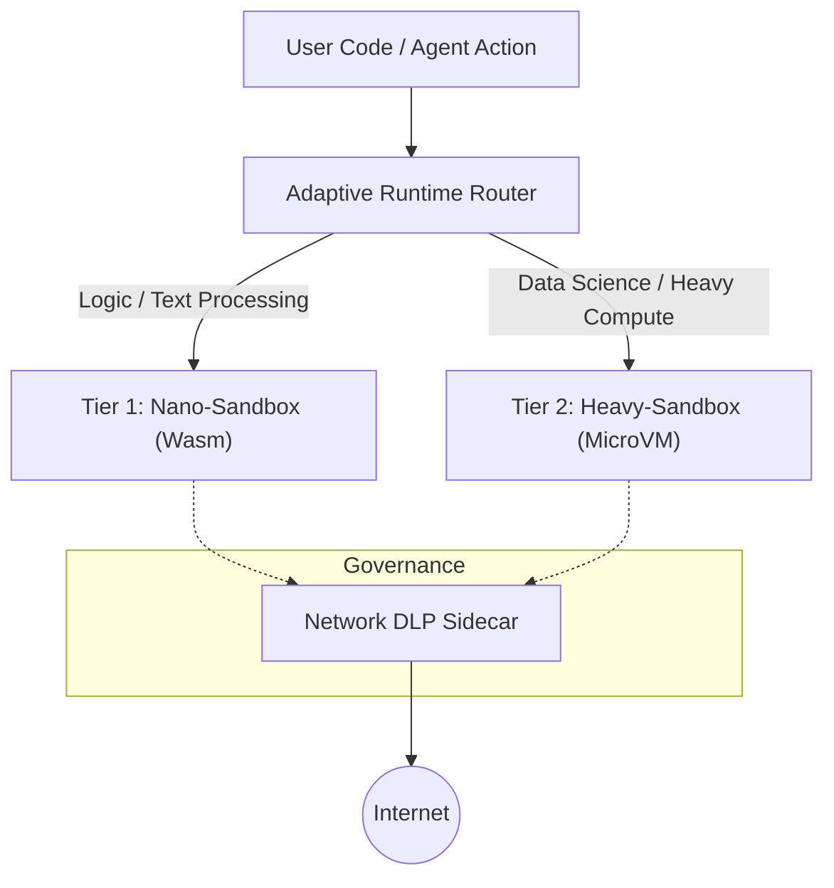

# ⏳ EnterSandBox

**Governance-First AI Agent Runtime Platform**

[](LICENSE)
[](docs/PLAN.md)
[🇯🇵 日本語 (Japanese)](README.ja.md)

EnterSandBox is a next-generation code execution platform focused on **Governance** and **Observability** for autonomous AI agents.
More than just a fast code execution environment (Runner), it achieves both "Speed" and "Compatibility" using hybrid runtime technology, while providing powerful control functions to meet enterprise security requirements.

---

## 🚀 Why EnterSandBox?

The rise of autonomous AI agents has created new requirements for infrastructure.

*   **Untrusted Code Execution:** Agents generate unknown and potentially dangerous code.
*   **Latency Sensitivity:** Millisecond-level startup speeds are required to clear chat UX benchmarks.
*   **The Data Science Wall:** Lightweight WASM alone cannot run essential libraries like Pandas and NumPy.
*   **Lack of Governance:** Traditional approaches cannot prevent Data Loss Prevention (DLP) issues or unintended access by agents.

EnterSandBox is the **"OS for AI Agents"** that solves these challenges.

## ✨ Key Features

### 1. Hybrid Runtime Architecture
Dynamically selects and routes to the optimal runtime based on task characteristics.

| Tier | Name | Tech Stack | Startup Speed | Use Case |
| --- | --- | --- | --- | --- |
| **Tier 1** | **Nano-Sandbox** | Wasmtime + RustPython | **< 10ms** | Control logic, string manipulation, JSON parsing |
| **Tier 2** | **Heavy-Sandbox** | Firecracker MicroVM | **~150ms** | Data Analysis (Pandas), Machine Learning, Complex Dependencies |

### 2. Agency Governance (Network DLP)
Prevents rogue agent behavior and ensures enterprise compliance.

*   **PII Scanning:** Real-time inspection of communication content to block leaks of API keys or personal information.
*   **Intent-based Whitelist:** Dynamically restricts accessible domains based on the agent's "current intent".
*   **Audit Logs:** Records all actions and communications, providing complete traceability.

### 3. Time Travel Debugging
Revolutionizes the developer experience (DX) with advanced debugging capabilities.

*   **Stepwise Snapshots:** Saves memory and disk state at each execution step.
*   **Rewind & Inspect:** "Rewind" to the state immediately before an error occurred to inspect variable values and file contents.

## 🛠 Architecture



## 🧩 Usage (Preview)

Users can utilize a unified API without being conscious of the underlying runtime.

```python
from agentbox import Sandbox, SandboxConfig

config = SandboxConfig(memory_limit_mb=256, timeout_ms=3000)
box = Sandbox(config)

result = box.run("print('Hello from sandbox')")
print(result)
```

## 🧾 SDK API (Current)

- `Sandbox(config: Optional[SandboxConfig] = None)`
- `Sandbox.run(code: str) -> str`
- `Sandbox.config -> SandboxConfig`
- `SandboxConfig(memory_limit_mb: Optional[int], timeout_ms: Optional[int])`

## 🗺 Roadmap

See [docs/PLAN.md](docs/PLAN.md) for details.

- **Phase 1:** Nano-Sandbox (MVP) - Ultra-fast execution environment based on Wasm
- **Phase 2:** Heavy-Sandbox & Routing - Firecracker integration and data science support
- **Phase 3:** Governance & Security - Network DLP and native MCP support
- **Phase 4:** Time Travel - Implementation of debugging functions and UI

## 📚 Documentation

- [Functional Specification (SPEC.md)](docs/SPEC.md) (Japanese)
- [Implementation Plan (PLAN.md)](docs/PLAN.md) (Japanese)
- [Research Report (RESEARCH.md)](docs/RESEARCH.md) (Japanese)

## 🤝 Contributing

EnterSandBox is planned to be developed as an open-source project.
Contribution guidelines are being prepared.

## 📄 License

MIT License (Planned)
