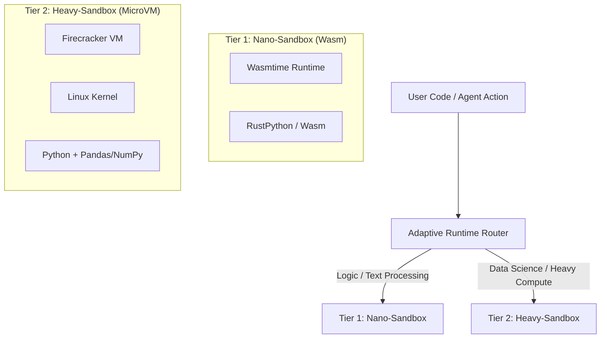

# AIエージェントガバナンスプラットフォーム「EnterSandBox」機能仕様書

## 1. プロダクト概要

**EnterSandBox**は、自律型AIエージェントの「ガバナンス」と「可観測性」に焦点を当てた、次世代のコード実行プラットフォームです。
単なる高速なコード実行環境（Runner）にとどまらず、ハイブリッドランタイム技術を用いることで「速度」と「互換性」の両立を実現し、同時に企業のセキュリティ要件を満たす強力な統制機能を提供します。

### コアバリュープロポジション

1.  **Hybrid Runtime Architecture:** タスクの性質に応じて、超軽量なWasm環境（Nano-Sandbox）と、完全なLinux環境（Heavy-Sandbox）を動的に使い分ける「適材適所」の実行モデル。
2.  **Agency Governance:** ネットワークDLP（情報漏洩防止）と動的なアクセス制御により、エージェントの「暴走」を防ぎ、企業コンプライアンスを遵守させる。
3.  **Time Travel Debugging:** エージェントの思考と実行状態をスナップショットとして保存し、任意の時点に巻き戻してデバッグ可能にする。

### ターゲットユーザー

*   **エンタープライズAI開発者:** 社内規定に準拠しつつ、自律エージェントを本番運用したいチーム。
*   **LLMプラットフォーム事業者:** ユーザーのコードを安全に実行する基盤を必要とするSaaSベンダー。

### セキュリティ設計原則

> [!CAUTION]
> **言語レベルサンドボックスの完全排除**
> 
> RestrictedPython等のインタプリタレベル制限には、CVE-2023-37271（ジェネレータスタックフレーム悪用）、CVE-2025-22153（例外処理の型混乱）など、多数のバイパス手法が発見されています。EnterSandBoxでは**いかなる場合もホストプロセス内でユーザーコードを直接実行しません（exec/evalの禁止）**。すべてのコード実行はWASMランタイムまたはMicroVMの物理的境界内で行われます。

## 2. システムアーキテクチャ

### 2.1 ハイブリッドランタイムモデル

EnterSandBoxは、入力されたコードと依存関係を解析し、最適なランタイムへ自動的にルーティングします。



| Tier | 名称 | 技術スタック | 特徴 | 用途 |
| --- | --- | --- | --- | --- |
| **Tier 1** | **Nano-Sandbox** | Wasmtime + RustPython | 起動 < 10ms, 低コスト | 文字列操作, JSONパース, 制御ロジック |
| **Tier 2** | **Heavy-Sandbox** | Firecracker MicroVM | 起動 ~150ms, 完全互換 | データ分析(Pandas), 機械学習, 複雑な依存関係 |

### 2.2 ガバナンス・サイドカー (Network DLP)

各サンドボックス（特にTier 2）には、透過型プロキシとして動作する「サイドカー」が配置され、アウトバウンド通信を監視します。

*   **PII Scanning:** リクエストボディに含まれるクレジットカード番号やAPIキーをリアルタイム検知・遮断。
*   **Intent-based Whitelist:** エージェントの現在の「意図（タスク）」に基づき、動的に許可ドメインを変更（例: 「天気予報を調べる」タスク中のみ `weather.com` を許可）。
*   **監査ログ:** すべての通信のヘッダーとボディ（DLPフィルタ後）を記録し、エージェントの行動履歴として管理者に提供。コンプライアンス監査や事後分析に対応。

### 2.3 MCP (Model Context Protocol) ネイティブホスティング

EnterSandBoxは、AnthropicとDockerが推進する**Model Context Protocol (MCP)** のゲートウェイを内蔵し、エージェントが標準化されたインターフェースを通じて外部ツールに接続することを容易にします。

*   **MCPサーバーのホスティング:** サンドボックス内でMCPサーバーを直接ホストし、エージェントがツール（ファイル操作、DB接続、Web検索等）にアクセス可能。
*   **セキュアなツール呼び出し:** MCP経由のツール呼び出しもガバナンス・サイドカーを通過し、DLPポリシーを適用。

## 3. 詳細機能要件

### 3.1. Tier 1: Nano-Sandbox (Wasm)

MVPとして先行実装される、超軽量・安全な実行環境。

*   **技術基盤:** Rust + Wasmtime + RustPython
*   **依存排除:** Docker不要、`pip install` されたバイナリのみで動作。
*   **分離モデル:** WebAssemblyのCapability-based Security。
    *   **ファイルシステム:** メモリ内仮想FSのみアクセス可。
    *   **ネットワーク:** デフォルト完全遮断（ソケット機能自体を非公開）。
*   **制限:** C拡張ライブラリ（NumPy等）は非サポート。

### 3.2. Tier 2: Heavy-Sandbox (MicroVM)

データサイエンスおよび既存のPythonエコシステムをフル活用するための環境。

*   **技術基盤:** Firecracker + Linux Kernel
*   **スナップショット起動:** 起動時間を短縮するため、事前にウォームアップされたメモリイメージから復元。
*   **プール管理:** 即座に利用可能なウォームVMをプールで管理し、リクエスト時の待機時間を最小化。
*   **機能:**
    *   `pip install` 可能な任意のパッケージの実行。
    *   永続化ボリュームのマウント。
    *   セッション間での状態の維持（マルチターンの会話でファイルシステムやメモリ状態を保持）。

### 3.3. タイムトラベル・デバッグ

開発者体験（DX）を革新するデバッグ機能。

*   **Stepwise Snapshots:** 実行の各ステップ（ツール呼び出し単位）で、VMのメモリとディスク状態の差分スナップショットを保存。
*   **Rewind & Inspect:** 開発者はエラー発生直前の状態に「巻き戻し」、その時点の変数値やファイルの中身を検査できる。
*   **Visual Artifacts:** 生成された画像（Matplotlib等）やファイルを、UI上で構造化データとして閲覧可能にする（`plt.show()` を自動キャプチャしBase64ではなく構造化アーティファクトとして表示）。

## 4. 技術的課題と対策

### 4.1 WASMにおけるNumPy/Pandasサポートの現状

> [!IMPORTANT]
> **データサイエンスの壁への対処方針**
>
> NumPy、Pandas、Scipyはfir C/Fortran拡張モジュールに依存しており、WASI向けコンパイルは技術的に極めて困難です。`wasi-wheels`等のプロジェクトは「実験的」または「メンテナンス停止中」の状態であり、サポートは不完全です。
>
> **EnterSandBoxの対策:** Tier 1 (WASM) ではNumPyサポートを約束せず「ロジック専用」と明確に位置付けます。`import pandas` や `import numpy` が検出された場合は、即座にTier 2 (MicroVM) へルーティングする判断ロジックを実装します。

### 4.2 オーケストレーションの技術選定

数千のMicroVMとネットワークサイドカーを管理するアーキテクチャには、以下を検討します:

*   **Knative / Nomad:** コンテナオーケストレーションとの親和性が高く、Firecrackerとの統合も進展中。
*   **Bottlerocket OS:** AWS上でのFirecrackerワークロードに最適化されたコンテナ専用OS。
*   **libkrun:** KVMベース仮想化をライブラリとしてプロセスに組み込み、VMMプロセス管理のオーバーヘッドを削減。

## 5. API設計 (Python SDK `agentbox`)

ユーザーは背後のランタイム（Tier 1 vs Tier 2）を意識することなく、統一されたAPIを利用します。

```python
from agentbox import Sandbox, SandboxConfig

# 自動ルーティングモード（デフォルト）
# コードの内容に応じて自動的に Tier 1 か Tier 2 が選択される
box = Sandbox()

# 明示的な指定も可能
# config = SandboxConfig(runtime="nano") # Tier 1
# config = SandboxConfig(runtime="heavy", packages=["pandas"]) # Tier 2

code = """
import json
data = {"status": "ok"}
print(json.dumps(data))
"""

result = box.run(code)
print(result.stdout)
```

## 6. 開発ロードマップ

`docs/RESEARCH.md` の提言に基づき、段階的に機能を実装します。

### Phase 1: The Nano-Sandbox (MVP)
**目標:** 「世界最速・最も手軽なPythonサンドボックス」のリリース。
*   **スコープ:** Tier 1 (Wasm) のみの実装。
*   **技術:** RustPython + Wasmtime on Rust（`componentize-py`を活用してPythonコードをWASMコンポーネント化）。
*   **提供形態:** PyPIパッケージ (`pip install agentbox`)。
*   **機能:**
    *   文字列操作、標準ライブラリの使用。
    *   メモリ内ファイルシステム。
    *   タイムアウト、メモリ制限の強制。

### Phase 2: The Heavy-Sandbox & Routing
**目標:** データサイエンス対応とハイブリッド実行の実現。
*   **スコープ:** Tier 2 (MicroVM) の統合とルーターの実装。
*   **技術:** Firecracker オーケストレーター構築（またはE2B等の既存APIラップから開始も検討）。プール管理によるレイテンシ削減。
*   **機能:**
    *   コード解析による自動ルーティング（import文の解析）。
    *   Pandas/NumPyのサポート。
    *   セッション間の状態維持。

### Phase 3: Governance & Security
**目標:** エンタープライズガバナンス機能の実装。
*   **機能:**
    *   ネットワークDLP（Envoy/Mitmproxyベースのサイドカープロキシ）。
    *   PIIスキャニング（クレジットカード番号、APIキー等の検出・遮断）。
    *   監査ログの詳細化。
    *   MCPネイティブホスティング。

### Phase 4: Time Travel
**目標:** 究極のデバッグ体験の提供。
*   **機能:**
    *   MicroVMのスナップショット管理API。
    *   デバッグ用Web UI / IDEプラグイン。
    *   視覚的アーティファクトの自動キャプチャ。

## 7. 付録: 競合優位性まとめ

| 機能 | EnterSandBox | E2B | DifySandbox | Wasm (Raw) |
| --- | --- | --- | --- | --- |
| **アーキテクチャ** | **Hybrid (Wasm + VM)** | VM (Firecracker) | Docker Container | Wasm |
| **起動速度** | **<10ms (Logic)** | ~150ms | ~1s+ | <10ms |
| **データ分析** | **対応 (Tier 2)** | 対応 | 対応 | 不可 |
| **ガバナンス** | **DLP + Intent Firewall** | ドメイン許可リスト | 基本的プロキシ | なし |
| **デバッグ** | **Time Travel** | ログのみ | ログのみ | なし |